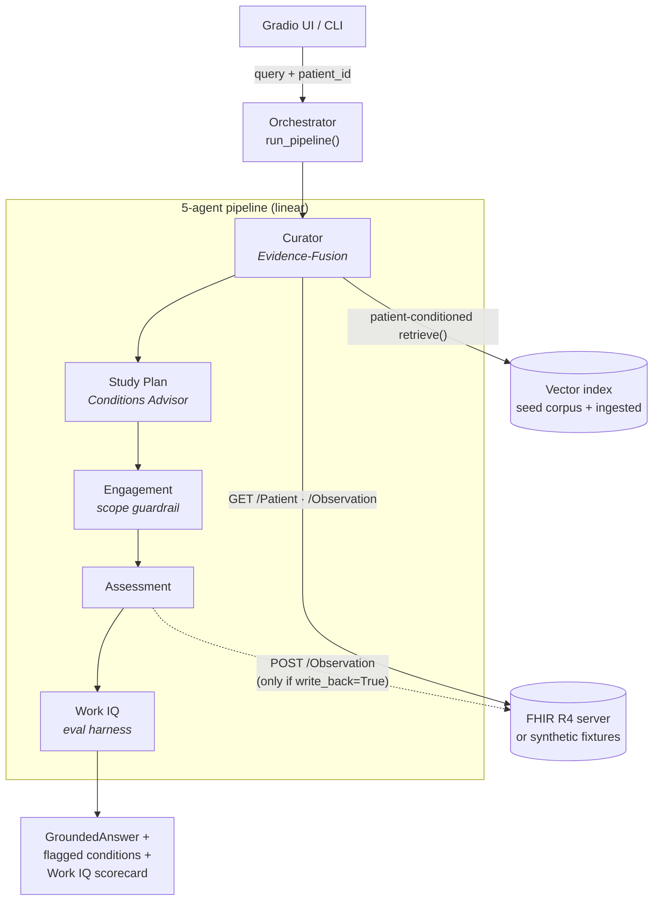

# Architecture

How the Clinical AI Agent is put together, and *why* it is built this way. For a
step-by-step trace of one request see [SESSION_FLOW.md](SESSION_FLOW.md); for
per-agent contracts see [AGENTS.md](AGENTS.md).

---

## Overview

The system turns **a clinical question + a patient ID** into three artifacts:

1. a grounded, **dual-cited** answer (evidence *and* patient data),
2. a list of **flagged conditions** (the Conditions/Gap Advisor), and
3. a reproducible **Clinical Work IQ** self-evaluation scorecard.

It does this by running five cooperating agents over a single shared state
object. The whole pipeline runs **offline by default** — deterministic stub LLM,
hashing embedder, in-memory vector index, and synthetic FHIR fixtures — so it is
reproducible in CI with zero credentials. Going live is a configuration change,
not a code change.



---

## The pipeline is linear, by design

`run_pipeline()` in [`orchestrator.py`](../src/clinical_agent/orchestrator.py)
executes the agents in a fixed order:

```
curator → study_plan → engagement → assessment → work_iq
```

The **Curator runs first** so every downstream agent shares the same patient
context and provenance-tagged evidence. There is **no conditional branching**
between agents — the `route` value that Engagement computes (`clinical` /
`directive` / `off_domain`) is *advisory*: it is used to rewrite the answer text
in place, not to redirect the graph.

> **Note vs. the original design.** The project's original blueprint sketched a
> conditional fan-out (`Curator → {Study Plan | Engagement | Assessment}`). The
> implementation deliberately collapses that into a deterministic line, which is
> simpler to reason about and — critically — makes the Work IQ evaluation
> reproducible (the same query always exercises the same path).

Two execution backends produce the **same** flow:

| Backend | Entry point | Dependencies | Used by |
|---|---|---|---|
| Plain Python | `run_pipeline()` | none beyond core | `app.py`, `cli.py`, tests |
| LangGraph | `build_langgraph_app()` | `[full]` extra | parity with blueprint; LangGraph tooling (checkpointing, streaming) |

---

## Shared state: `AgentState`

Every agent receives and returns the same `AgentState` TypedDict
([`state.py`](../src/clinical_agent/state.py)). It starts with only the input and
**accumulates** keys as it flows down the pipeline — so you can inspect the
partial result after any agent.

| State key | Type | Written by | Meaning |
|---|---|---|---|
| `query` | `str` | *input* | The clinician's question |
| `patient_id` | `str` | *input* | FHIR `Patient` logical id |
| `learner_profile` | `dict[str,float]` | *input* / Assessment | `{topic: mastery 0..1}`; drives difficulty scaling |
| `responses` | `dict[str,int]` | *input* | `{topic: selected_index}` to grade (optional) |
| `patient` | `Patient \| None` | Curator | Parsed demographics |
| `observations` | `list[Observation]` | Curator | Recent vitals/labs |
| `literature` | `list[LiteratureCitation]` | Curator | Retrieved evidence chunks |
| `patient_citations` | `list[PatientCitation]` | Curator | FHIR data points used |
| `answer` | `GroundedAnswer \| None` | Curator (mutated by Engagement) | Dual-cited answer |
| `flagged_conditions` | `list[dict]` | Study Plan | Threshold-rule hits |
| `study_plan` | `list[dict]` | Study Plan | Ordered learning modules |
| `route` | `str` | Engagement | `clinical` / `directive` / `off_domain` (advisory) |
| `nudges`, `digest` | `list[str]`, `str` | Engagement | Adherence prompts + session roll-up |
| `confidence` | `str` | Engagement | `high` / `moderate` / `low` retrieval confidence |
| `assessment` | `dict` | Assessment | MCQ items, gradings, mastery (+ write-back ids) |
| `work_iq` | `dict` | Work IQ | The Clinical Work IQ scorecard |
| `trace` | `list[str]` | every agent | Human-readable execution log |

---

## Offline-first design

Three swappable backends let the system run with no network and no keys. Each has
a deterministic **stub** default and a **live** implementation selected by config:

| Concern | Stub default | Live implementation | Selected by |
|---|---|---|---|
| LLM | `StubLLM` (extractive) | `OpenAILLM` · `AnthropicLLM` | `LLM_PROVIDER` |
| Embeddings | `StubEmbedder` (md5 hashing BoW, 256-dim) | `SentenceTransformerEmbedder` | `EMBED_PROVIDER` |
| Vector index | in-memory cosine | persistent ChromaDB collection | `USE_CHROMA` |
| FHIR data | synthetic fixtures | `httpx` against any FHIR R4 server | `FHIRClient(use_fixtures=…)` |

All live backends are real and verified; only the defaults are stubs. `get_llm()`
falls back to the stub if a provider is selected without its API key, and the
ChromaDB path falls back to in-memory if `chromadb` isn't installed — so
misconfiguration degrades gracefully instead of crashing.

### Why a stub LLM?

`StubLLM` ([`rag/llm.py`](../src/clinical_agent/rag/llm.py)) is **extractive**: it
composes its answer purely from the supplied context sentences. This guarantees
high groundedness, which makes the faithfulness and citation metrics meaningful in
CI without paying for — or depending on — a real model.

The trade-off: the stub does **not reason**. It surfaces the highest-ranked
retrieved chunk even when that chunk doesn't apply to the patient's actual values.

> **Worked example of the limitation.** In the shipped demo the patient's LDL is
> `110 mg/dL` (normal), yet the stub answer *leads* with "LDL ≥ 190 mg/dL warrants
> high-intensity statin therapy" — simply because the retriever ranked that chunk
> first and the stub does not filter by applicability. Set `LLM_PROVIDER=openai`
> to get an LLM that actually weighs the evidence against the patient. **Treat
> stub output as a plumbing demonstration, not clinical reasoning.**

### Why a hashing embedder?

`StubEmbedder` hashes tokens into a 256-dimension bag-of-words vector. Cosine
similarity is meaningful because shared tokens collide into shared dimensions —
enough to rank the diabetes chunk first for a diabetes query — but it is weak:
many queries leave only one chunk above `RETRIEVAL_MIN_SCORE` (0.15). For real
semantic retrieval, set `EMBED_PROVIDER=sentence-transformers`.

---

## Dual-citation model — the differentiator

Defined in [`models/citation.py`](../src/clinical_agent/models/citation.py). Every
answer carries **two** kinds of provenance:

```
GroundedAnswer
├── text:        str
├── literature:  list[LiteratureCitation]   # [source] title <url>   (the evidence)
└── patient:     list[PatientCitation]       # [Observation/id] label = value @ date  (this patient's data)
```

`GroundedAnswer.render_markdown()` emits both blocks under **"Patient data used:"**
and **"Evidence:"** headings. This is the capability a scan of 9 frontier healthcare-AI companies found
unoccupied: an open agent that proves both *what evidence* it rests on **and**
*which of this patient's data* it used.

---

## Module map

```
src/clinical_agent/
  config.py        Pydantic settings; the `offline` property
  state.py         AgentState contract (table above)
  orchestrator.py  run_pipeline() + build_langgraph_app()
  cli.py           offline smoke entrypoint
  fhir/            client (httpx/fixtures), auth (SMART OAuth2), patient, observation
  rag/             embeddings, corpus (seed), retriever, ingest, llm, prompts
  agents/          curator, study_plan, engagement, assessment, work_iq
  eval/            synthetic (fixtures + safety cases), rag_metrics
  models/          patient, observation, citation (dual-citation primitives)
  ui/              layout (Gradio Blocks), citations (foundation-paper header)
```

See [EXTENDING.md](EXTENDING.md) to add a corpus document, a Conditions rule, a
new agent, or a real LLM/embedder backend.
