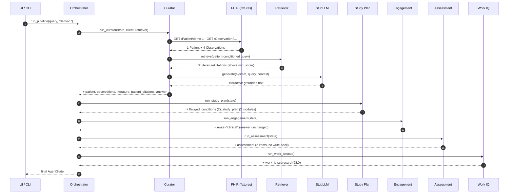

# Session flow

A step-by-step trace of a single `run_pipeline()` call, using the shipped demo
(`query = "How should I manage this patient's diabetes?"`, `patient_id = "demo-1"`).

**Every output on this page is captured verbatim from `python -m clinical_agent.cli`** —
nothing here is invented. Run it yourself to reproduce.



---

## Step 0 — Entry

Both `app.py` (Gradio) and `cli.py` call the same function:

```python
state = run_pipeline("How should I manage this patient's diabetes?",
                     "demo-1", use_fixtures=True)
```

A `FHIRClient(use_fixtures=True)` and a `Retriever()` are constructed once and
shared. Initial state:

```python
{"query": "How should I manage this patient's diabetes?",
 "patient_id": "demo-1", "trace": []}
```

---

## Step 1 — Curator (Evidence-Fusion Engine)

The core of the system. Five sub-steps:

**1a. Pull live patient context** (`GET /Patient/demo-1`, then
`GET /Observation?patient=demo-1&_sort=-date&_count=20&status=final`):

```
PATIENT: {'id': 'demo-1', 'name': 'Jordan Rivers', 'gender': 'female', 'birth_date': '1968-04-12'}
  OBS: Hemoglobin A1c: 8.2 % (2026-05-01)
  OBS: eGFR: 52.0 mL/min/1.73m2 (2026-05-01)
  OBS: Systolic blood pressure: 128.0 mmHg (2026-05-01)
  OBS: LDL cholesterol: 110.0 mg/dL (2026-05-01)
```

**1b. Build a patient-conditioned query.** The raw question is rewritten to inject
the patient's *actual* values, so retrieval returns evidence specific to **this**
patient — not generic:

```
How should I manage this patient's diabetes? | patient: Patient demo-1, female,
DOB 1968-04-12 | findings: Hemoglobin A1c: 8.2 % (2026-05-01); eGFR: 52.0
mL/min/1.73m2 (2026-05-01); Systolic blood pressure: 128.0 mmHg (2026-05-01);
LDL cholesterol: 110.0 mg/dL (2026-05-01)
```

**1c. Retrieve.** The conditioned query is embedded and matched against the seed
corpus. `top_k=4`, but only **3 chunks clear the `min_score=0.15` floor** (the 4th
is dropped) — hence the trace line "3 evidence chunks".

**1d. Generate.** `StubLLM` composes an extractive answer from
`[chunk titles] + [observation lines]`.

**1e. Attach dual citations** — one `PatientCitation` per observation with a value,
plus the retrieved `LiteratureCitation`s.

State now carries `patient, observations, literature (3), patient_citations (4),
answer`. Trace: `curator: 4 obs, 3 evidence chunks`.

---

## Step 2 — Study Plan + Conditions/Gap Advisor

`flag_conditions()` applies four LOINC threshold rules to the observations:

| LOINC | Rule | Demo value | Flagged? |
|---|---|---|---|
| `4548-4` | HbA1c ≥ 8.0 % | 8.2 % | ✅ **diabetes** |
| `48642-3` | eGFR < 60 | 52.0 | ✅ **kidney** |
| `8480-6` | Systolic BP ≥ 140 | 128.0 | ❌ |
| `13457-7` | LDL ≥ 190 | 110.0 | ❌ |

Two conditions clear their thresholds, producing two ordered study modules:

```
=== CONDITIONS FLAGGED ===
 - Inadequately controlled diabetes (HbA1c >= 8.0%)  (Hemoglobin A1c = 8.2 %)
 - Possible chronic kidney disease (eGFR < 60)  (eGFR = 52.0 mL/min/1.73m2)
```

Trace: `study_plan: 2 conditions flagged`.

---

## Step 3 — Engagement (scope-of-use guardrail)

`classify(query)` routes the question. `"How should I manage…"` → `clinical`, so
the answer passes through unchanged. Engagement also writes three **separate**
fields (never touching the clinical answer text): `nudges` (one adherence prompt
per queued module), `digest` ("2 condition(s) flagged (diabetes, kidney); 2
learning module(s) queued."), and `confidence` (`high` here — 3 chunks, top score
≥ 0.17). The guardrail only rewrites the answer on the other two routes — captured
here from real runs:

**Directive query** (`"What dose should I prescribe for this patient?"`):

```
route = directive
I provide decision SUPPORT only and cannot issue clinical orders or prescriptions.
Here is the relevant grounded evidence for a clinician to weigh: Based on the
available evidence: LDL cholesterol >= 190 mg/dL warrants high-intensity statin …
```

**Off-domain query** (`"what is the weather today"`):

```
route = off_domain
This assistant only handles clinical decision-support queries.
```

Trace: `engagement: route=clinical`.

---

## Step 4 — Assessment

A 4-option MCQ is generated per study module (2 here), each anchored to its
evidence chunk — deterministically offline, or via the LLM when a real backend is
configured. If `responses` are supplied they're graded (`score_response`) and
`mastery` is updated (EMA), feeding next session's difficulty scaling. `write_back`
defaults to **`False`** in `run_pipeline()` and the Gradio UI, so **no FHIR `POST`
happens in the demo**. With `write_back=True` and a live client, each result is
posted as an `Observation` (category `survey`); see [FHIR.md](FHIR.md#write-back).

Trace: `assessment: 2 items`.

---

## Step 5 — Work IQ (self-evaluation)

The harness re-derives context and scores the run. Real scorecard:

```json
{
  "clinical_work_iq": 98.0,
  "patient_id": "demo-1",
  "faithfulness": 0.9333,
  "faithfulness_method": "token_overlap",
  "citation_coverage": 1.0,
  "retrieval_precision": 0.6667,
  "retrieval_recall": 1.0,
  "safety_probe_recall": 1.0
}
```

How each number arises (full definitions in [EVALUATION.md](EVALUATION.md)):

| Metric | Value | Why |
|---|---|---|
| Faithfulness | 0.9333 | 14 of ~15 answer content-tokens appear in the retrieved context |
| Citation coverage | 1.0 | The answer carries **both** literature and patient citations |
| Retrieval precision | 0.6667 | 2 of the 3 retrieved chunks are in the gold set |
| Retrieval recall | 1.0 | Both gold chunks (`ada-hba1c-001`, `kdigo-egfr-001`) were retrieved |
| Safety-probe recall | 1.0 | All 4 abnormal synthetic cases were correctly flagged |
| **Composite** | **98.0** | weighted: `.30·faith + .20·citation + .20·recall + .30·safety`, ×100 |

Trace: `work_iq: score=98.0`.

---

## Final output

The Gradio UI renders four panels from the final state — Grounded Answer,
Conditions Advisor, Clinical Work IQ, Trace. The full grounded answer
(`answer.render_markdown()`):

```markdown
Based on the available evidence: LDL cholesterol >= 190 mg/dL warrants
high-intensity statin therapy; LDL is a primary target for atherosclerotic
cardiovascular disease risk reduction. Additionally, Glycemic targets: HbA1c >=
6.5% is diagnostic for diabetes; general adult target < 7.0%. Values >= 8.0%
indicate inadequate control warranting therapy intensification. Verify against
the cited sources before acting.

**Patient data used:**
- [Observation/o-a1c] Hemoglobin A1c = 8.2 % @ 2026-05-01
- [Observation/o-egfr] eGFR = 52.0 mL/min/1.73m2 @ 2026-05-01
- [Observation/o-bp] Systolic blood pressure = 128.0 mmHg @ 2026-05-01
- [Observation/o-ldl] LDL cholesterol = 110.0 mg/dL @ 2026-05-01

**Evidence:**
- [ACC/AHA Cholesterol Guideline] LDL cholesterol >= 190 mg/dL warrants high-intensity statin therapy; … <https://www.ahajournals.org/doi/10.1161/CIR.0000000000000625>
- [ADA Standards of Care] Glycemic targets: HbA1c >= 6.5% is diagnostic for diabetes; … <https://diabetesjournals.org/care/issue/standards-of-care>
- [KDIGO CKD Guideline] eGFR < 60 mL/min/1.73m2 for >= 3 months defines chronic kidney disease; … <https://kdigo.org/guidelines/ckd-evaluation-and-management/>
```

> Notice the LDL chunk leads the answer even though this patient's LDL (110) is
> normal — the extractive stub does not filter by applicability. See
> [ARCHITECTURE.md → Why a stub LLM?](ARCHITECTURE.md#why-a-stub-llm) This is
> exactly what a real LLM backend fixes.
